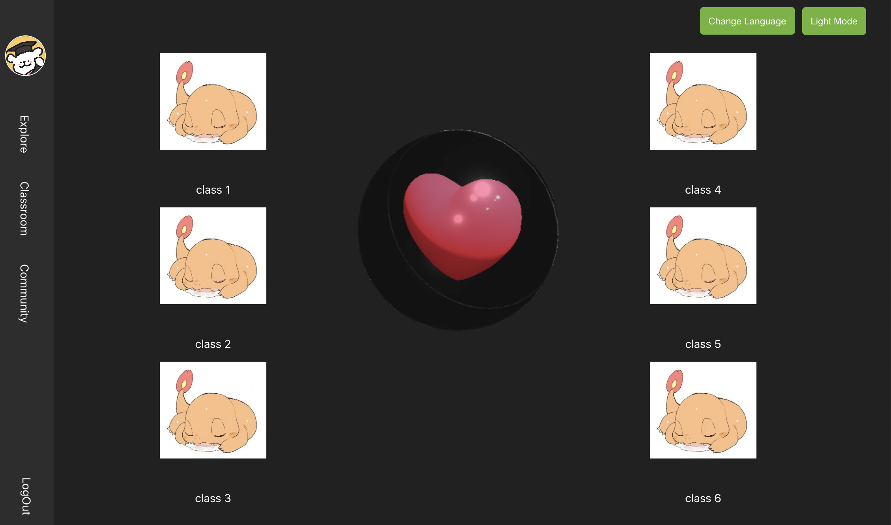

# Project Setup Instructions

Welcome to our React project!

<https://accessilingo.onrender.com/>




## Prerequisites

Need to have Node.js and npm installed on your computer. 

## Setting Up the Project

1. **Clone the Project:**

2. **Install Dependencies:**
   - Change into the project directory:
     ```
     cd <project-name>
     ```
   Replace `<project-name>` with the name of the folder that was created when you cloned the project.
   - Run the following command to install the project dependencies:
     ```
     npm install
     ```

3. **Start the Project:**
   - Once the installation is complete, start the project by running:
     ```
     npm start
     ```
   - This will launch the development server on port 3000
